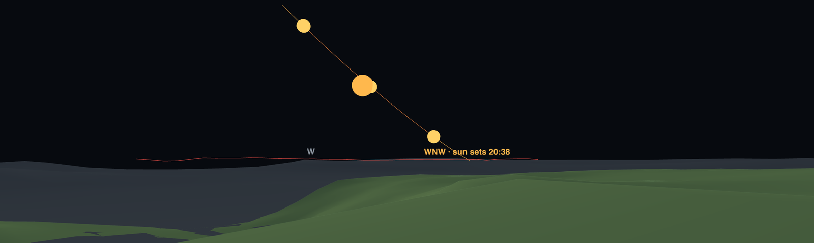
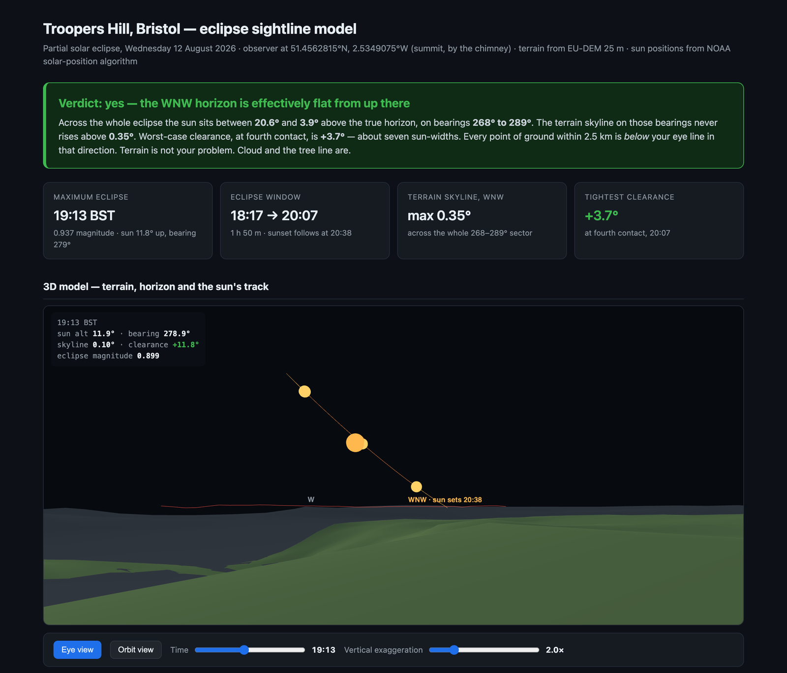
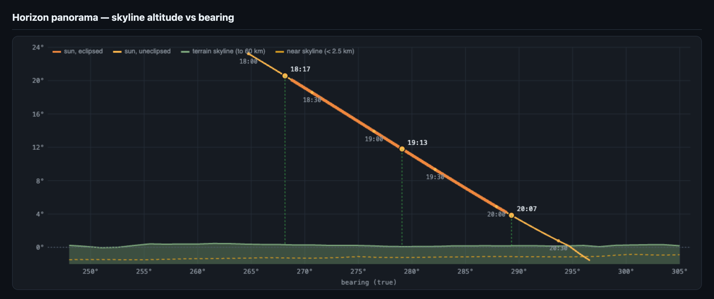
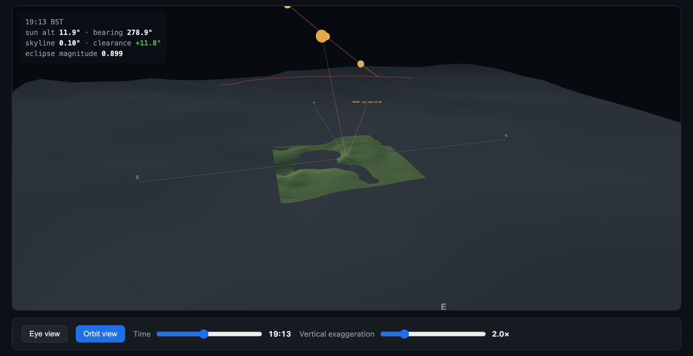
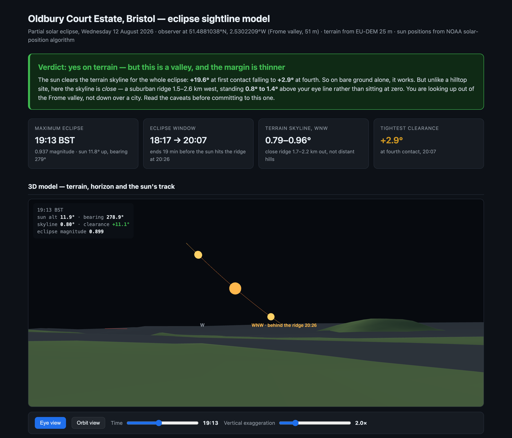
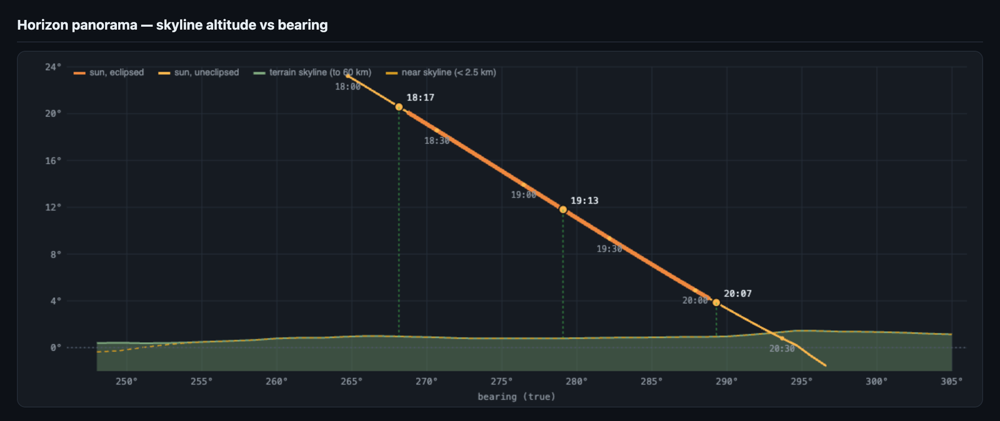
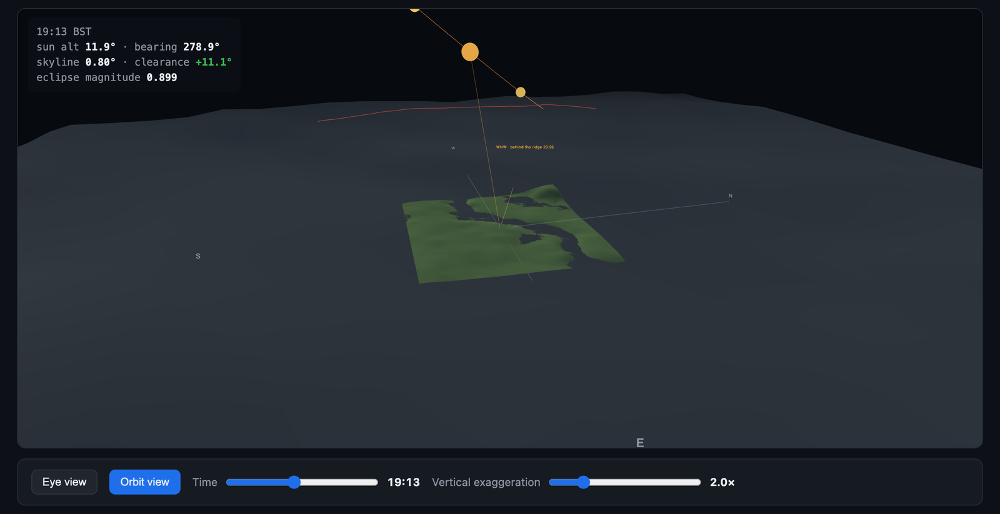
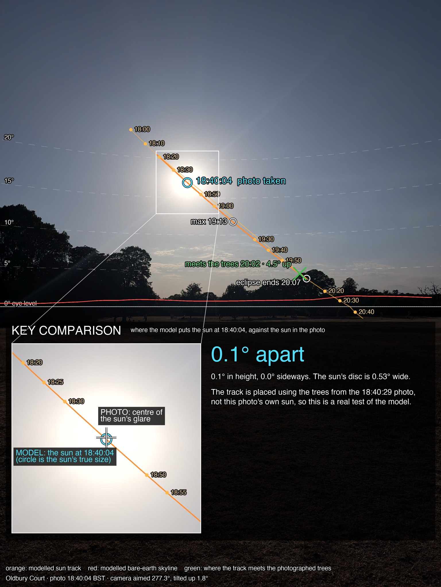
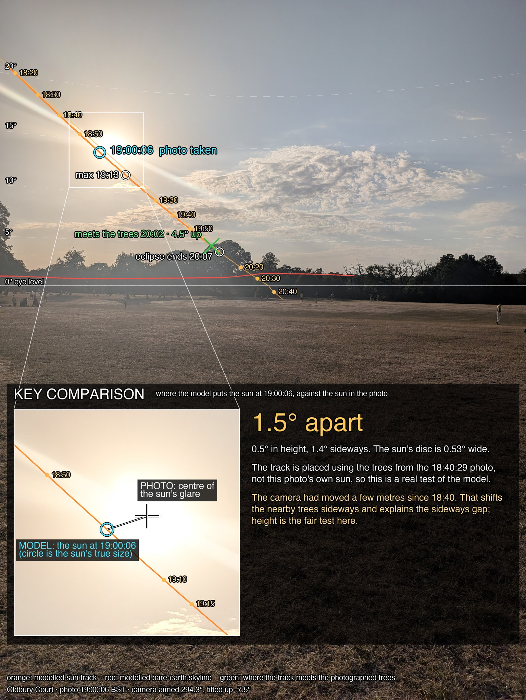
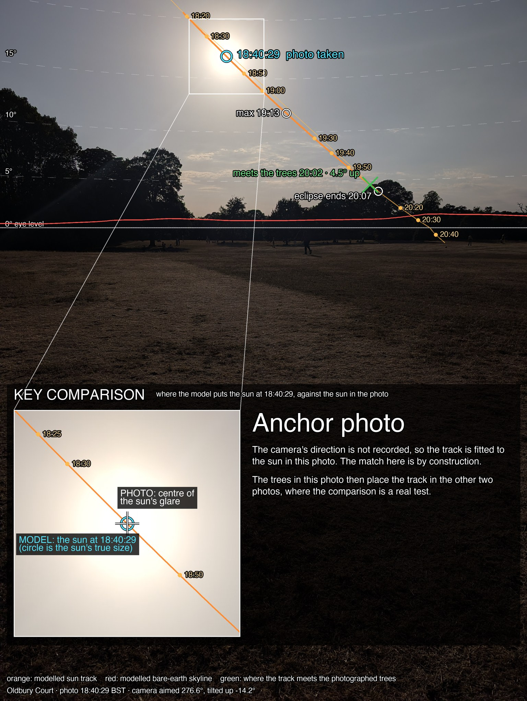

# EclipseViewer



Can you see the partial solar eclipse of **12 August 2026** from Bristol, or does the horizon get in the way?

The eclipse happens in the evening with the sun low in the west-north-west, so the answer depends on the skyline. This project models that skyline from elevation data for two viewing spots and compares it with the sun's path.

| Site | Page | Verdict |
| --- | --- | --- |
| Troopers Hill (summit, 71 m) | `troopers-hill-eclipse.html` | Clear. The skyline never rises above 0.35°, leaving +3.7° of clearance at the end of the eclipse. |
| Oldbury Court (Frome valley, 51 m) | `oldbury-court-eclipse.html` | Clear, but tighter. A ridge 1.5–2.6 km west sits 0.8–1.4° up, leaving +2.9° at the end. [On the day](#on-the-day), trees hid the last few minutes. |

Eclipse times for Bristol (BST): begins 18:17, maximum 19:13 (94% magnitude), ends 20:07.

## Screenshots

### Troopers Hill



*Overview: the verdict, the key numbers and the view from the summit at maximum eclipse, with the sun's track dropping towards a flat skyline.*



*Horizon chart: the sun's altitude against the terrain skyline, which stays close to 0° across the whole sector.*



*Orbit view: the summit patch at the centre of the regional terrain, with sightlines to the sun.*

### Oldbury Court



*Overview: from the valley floor the nearby ridge stands above eye level, so the clearance is smaller.*



*Horizon chart: the skyline sits around 1° up, and the sun meets it at 20:26, before true sunset.*



*Orbit view: the valley site at the centre of the regional terrain, with sightlines to the sun.*

## On the day

Three phone photos taken at Oldbury Court during the eclipse, with the model drawn over them. The key comparison in each is the cyan circle, where the model puts the sun at the moment the photo was taken, against the sun in the photo.

The camera's direction isn't recorded, so one photo has to act as the anchor: in the 18:40:29 photo the track is fitted to the sun. The trees in that photo then place the track in the other two, so those are real tests.



*18:40:04 BST, a real test: the model's sun is 0.1° from the sun in the photo. The sun's disc is 0.53° wide.*



*19:00:06 BST, a real test from a few metres away: 0.5° out in height and 1.4° sideways. Moving shifts the nearby trees sideways, which accounts for the sideways gap.*



*18:40:29 BST, the anchor photo: the match here is by construction.*

What the photos show:

- **The sun's height matched the model to about 0.5°** between photos 20 minutes apart, during which the sun dropped 3.1°. Two photos taken 25 seconds apart from the same spot agree to 0.1°.
- **The sun's bearing couldn't be tested over the 20 minutes.** The 1.4° sideways gap is what moving a few metres does to trees about 150 m away.
- **Trees, not terrain, were the skyline.** They stand 2–5° up across the sunset arc, against about 1° for the bare-earth model.
- **The end of the eclipse was probably hidden.** All three photos put the sun's centre reaching the trees at about 20:02, at 4.5° up, five minutes before the eclipse ended at 20:07.

The crossing time depends on the lens's field of view, taken as 24 mm equivalent from the photo metadata. At 22 mm it would be about 20:07 and at 26 mm about 19:57.

## Viewing

Open either HTML file in a browser. Each page is self-contained, with:

- a verdict and the key numbers
- an interactive 3D terrain model with the sun's track, viewable from the observer's eye or from orbit
- a chart of sun altitude against the terrain horizon
- a table of contact times and clearances

Nothing needs to be built or served. The only external dependency is three.js, loaded from a CDN.

## How it works

- **Terrain:** EU-DEM v1.1 elevation data (25 m resolution). 39 sightlines fan out from the observer between bearings 248° and 305°, sampled out to 60 km. The highest angle along each sightline is the horizon on that bearing.
- **Horizon angle:** corrected for Earth curvature and standard atmospheric refraction, from an eye height of 1.6 m.
- **Sun position:** the NOAA solar position algorithm, cross-checked against timeanddate.com to within 0.1°.

The model is bare earth, with no trees or buildings, so the real skyline is higher wherever those stand on it.

## Layout

```
troopers-hill-eclipse.html    Finished page, Troopers Hill
oldbury-court-eclipse.html    Finished page, Oldbury Court
eclipse/                      Analysis and page source, Troopers Hill
eclipse-oc/                   Analysis and page source, Oldbury Court
photos/                       Photos from the day at Oldbury Court, and the model overlays
deploy/                       Netlify-ready copy of the Troopers Hill page
```

In each analysis folder, `sun.py` computes the sun's position, `analyse.py` compares it with the horizon profile and writes `analysis.json`, and `template.html` is the page that the results and terrain grids are embedded in.

## Re-running the analysis

Requires Python 3, standard library only.

```sh
cd eclipse        # or eclipse-oc
python3 analyse.py
```

This prints the clearance at each contact and rewrites `analysis.json`.

To rebuild the photo overlays (needs `numpy` and `Pillow`):

```sh
cd eclipse-oc
python3 overlay.py
```

## Deploying

`deploy/` is ready to drop onto Netlify. See `deploy/README.md`.

## Safety

Never look at the sun without certified eclipse glasses (ISO 12312-2) or a proper solar filter, even at 94% coverage.
